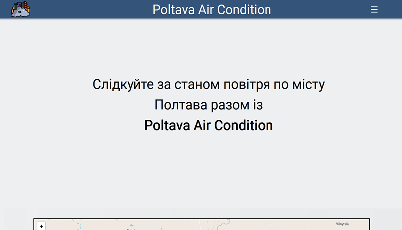
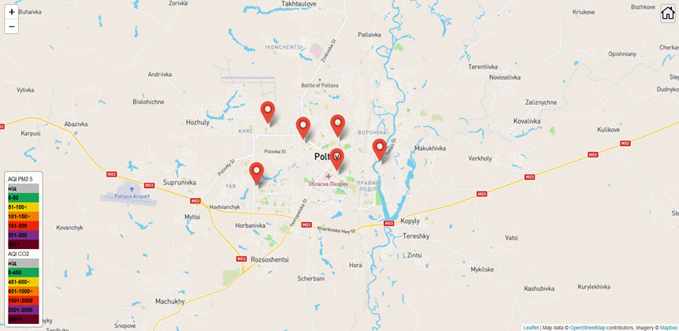
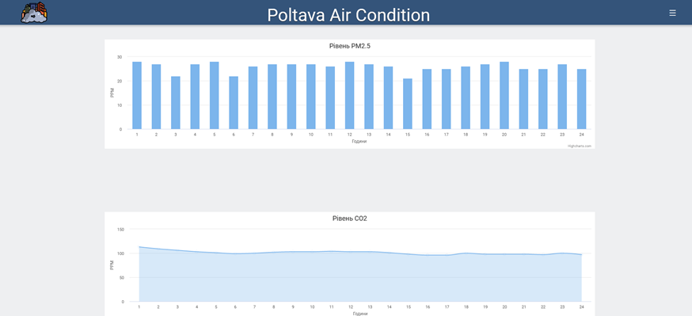
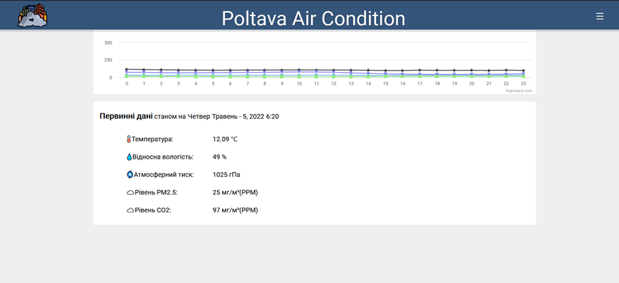
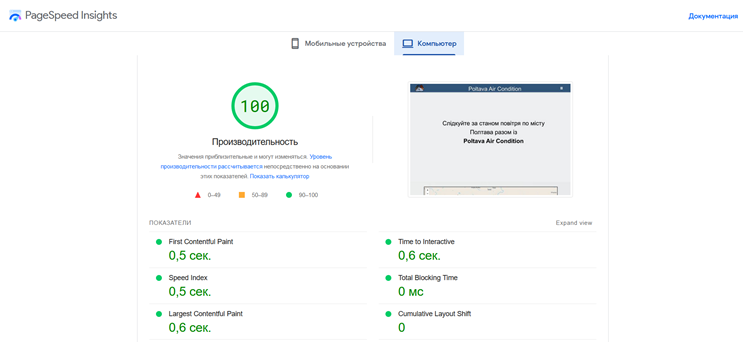
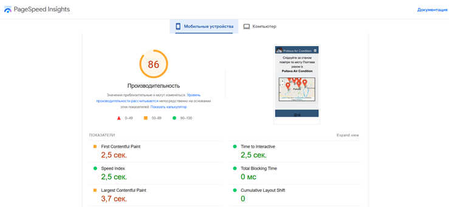

# PoltavaAirCondition
PoltavaAirCondition - is school science project that won # place in Ukrainian [MAN](https://man.gov.ua/) tour in Kyiv in 2022🏆. It is aimed to observe local air quality 🌱 and provide all accessible data to the user via interactive map 🗺 Web page is totaly adaptive for any types of devises🖥.

## Map of air sensors located all over Poltava
The map of air quality sensors contains markers that have links to special data-pages for each sensor where structured in charts data of air quality placed.
Legenda took place in left bottom corner. 

### Important information about map page:
* The map is rendering automaticaly with using [Leaflet API](https://leafletjs.com/)
* Page does not colect cache what allows it to re-render each 5-10 mints with new information on pointers 

## Data charts page
PoltavaAirCondition provides data of air polution sorted by hours in range of 24 hour in next charts:

### Important information about charts page:
* First three charts are generated automaticaly with using data from lokal database created with MySQL and using [Charts.js](https://www.chartjs.org/) 
* The bottom table with temperature, air presure and ect. is generated automaticaly using [OpenWeather API](https://openweathermap.org/)

## Productivity and speed of PoltavaAirCondition
Here is google-speed-insights test resultes for PC and Mobile devises are provided:

